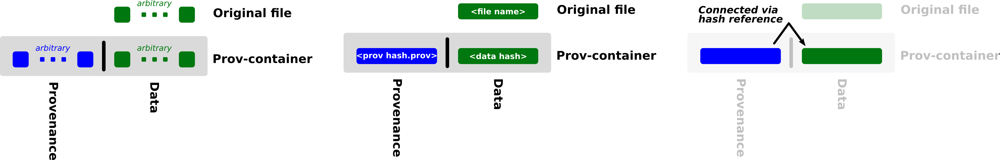
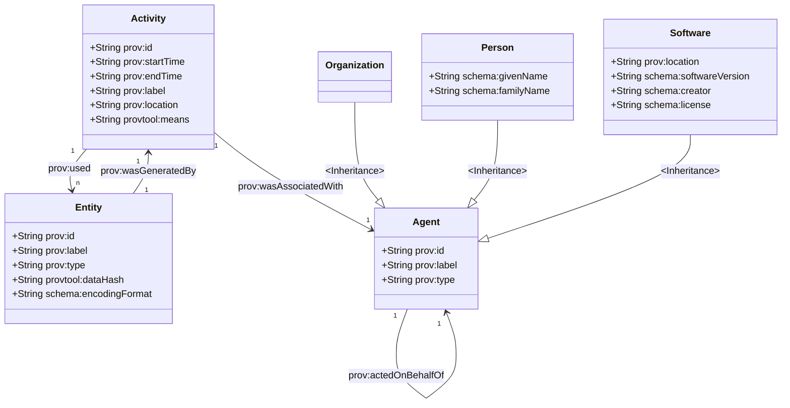

# Provtool

## Software bill of materials

See pyproject.toml in the src sub folders. Additionally, the BoM should be automatically added to the README via a git commit hook (see [Development](#development)).

### Generated BoM

|Library|
|-------|
|"cryptography==39.0.0"|
"GitPython==3.1.27"|
"importlib-metadata==4.11.4"|
"jsonschema==4.6.0"|
"matplotlib==3.5.2"|
"pandas==1.4.2"|
"prov==2.0.0"|
"provtoolutils==0.16.4"|
"python-dateutil==2.8.2"|
"requests==2.28.2"|

#### Note

Please note: The **examples** provided in the subdirectories may provide additional dependencies. The ones listed here are just applying for the core functionality which is installable via pip in:
- provtoolutils
- provtoolutils\_localcontainerreader
- provtoolval
- provtoolvis

## General

The reviewability of _data_ is one of the key ingredient for informed data usage in modern data and model based scenarios. Here, the term _data_ refers to digital artefacts in general, independent of the fact that it is raw data, documents or derived data and independent of its storage. The use cases range from data reuse after some time, data sharing between stakeholders in heterogeneous environments, decisions based on digital twins up to virtual certification. In general everything which is related to physical-temporal separation of data creation and usage. The term reviewability means the ability to make an informed decision about using a given data for an intended purpose based on its origin.

_Data_ is only reviewable if enough provenance meta data is provided to an evaluating user or algorithm. Provenance means the information about the origin of _data_. While for some provenance use cases a very fine grained detail is needed (for example to restart workflows, reproduce data, ...), reviewability of _data_ only needs a coarse grained level of detail. To provide reviewability, the provenance information must include enough information to trace a given piece of _data_ from its current form back to the primary data sources and all intermediate steps and data sources.

The validity of _data_ and its provenance need to be provable. This is achieved with the _provenance container_ approach and the use of hash sum stamping (see: Dressel, Alen: "Common Source & Provenance at Virtual Product House", DLRK 2021). It enables the formation of an unforgeable chain (see for example "How To Time-Stamp a Digital Document, Haber & Stornetta, Journal of Cryptology (1991) 3) which connects the different steps from a given piece of data to its origins with the help of provenance.

The provtool library contains the Python tooling, to easily work with provenance container. It is implemented in python but defines the test data and works as reference implementation also for other languages.

## Repository layout

The repository is structured in the following way:

| Directory                                                                  | Content                                                   |
|----------------------------------------------------------------------------|-----------------------------------------------------------|
| src                                                                        | The source of all subprojects                             |
| [src/provtoolutils\_localreader](src/provtoolutils\_localreader/README.md) | Plugin for searching provenance container by hash locally |
| [src/provtoolutils](src/provtoolutils/README.md)                           | Main data model and basic tools                           |
| [src/provtoolval](src/provtoolval/README.md)                               | Tooling for provtoolval of provenance chains              |

## Data model

The layout of the _provenance container_ is sketched in the following figure. It consists of a data part, which contains the original _data_ unchanged and an provenanc part, which contains the provenance for the _data_. The link between both is established via a reference to the hash sum of _data_ stored within the provenance.



As data model for the provenance, a simplified [W3C model](https://www.w3.org/TR/prov-dm/) is used according to the following figure.



## Examples

Please see [src/utils/examples](src/utils/examples/README.md) for examples.

## Plugins

For reading/finding the provenance containers, there is a plugin architecture defined. It uses the [setuptool entry point functionality](https://packaging.python.org/en/latest/guides/creating-and-discovering-plugins/) with the group name _provtoolutils.reader_. See _localcontainer_ directory for an example.

## Design decisions

### 1. Data location is ir🐘 as proof of integrity

In contrast to analog things, the proof of identity/non-tampering of digital data does not depend on storage location or ownership. Identity can be established through finger printing like hash sums and similar methods over the data content. According to current literature, some of methods are proven to be secure even under attacks by quantum computers. 

Data location may be r🐘 for providing/denying access to the data content itself or provide meta information in the form of "A is able to know the data". Nevertheless, this is not a requirement for all use cases.

**Therefore, a data location or a specific data management system will not be required when providing reviewability for data. The reviewability should work seamlessly with as much location aware and unaware contexts as possible.**

### 2. Allow separated storage of data and provenance

If _data_ and provenance is shared between multiple stakeholders, different protection levels for _data_ and provenance may be needed. Therefore, both parts need to be separable. The entry point for using _data_ should be the provenance part. It may reference (via content addressable hash) to the _data_. The separation opens up further possibilities for completely distributed, content addressable setups, where provenance and _data_ is stored at different, distributed locations. The provenance container can be created as a logical artefact.

**Therefore, provenance and _data_ will be stored separated from each other.**

### 3. No central common instance

Data sharing is nowadays possible with a plethora of different tools (email, file share, mediums, ...). Even if provenance should only be recorded for certain use cases/applications, this would mean in many cases connect all these tools to the central instance (it can be loosely coupled in the form of standardize API). This is already some effort in setup and maintenance within one organizational context (company, organization, ...). In case of projects spanning multiple partners with different technologies and IT guidelines all these partners would have to submit to the central instance. This raises severe concerns with respect to system coupling, IP and security.

The main reason for a central instance when dealing with provenance would be (roughly ordered according to assumed industry ranking):

1. Safety of intellectual property (details about a technical process may be inferred from provenance and data flows)
2. Advanced analysis based on data (data warehousing, data analytics, BI, ...)
3. Data protection (GDPR)
4. Security (for example phishing attacks based on provenance information, ...)

For these points, some mitigations exists:

1. In the scenario with multiple, heterogeneous stakeholders discussed here, data sharing between partners is given. Therefore, the question of IP protection is already set.
2. Data analysis is specific to given use cases. In a multi-stakeholder scenario, some partners may have different analysis needs than others. Therefore, they will build a data analytics platform for their specific needs. It is expected, that such a platform will be dynamically setup and will collect all data needed for the analysis task.
3. Provenance may expose information, which is r🐘 with respect to the GDPR. On the other hand, this information is needed to review the data (was the person creating it qualified for the process, ...). This is a general provenance problem and may be mitigated with general GDPR-sensitive approaches like pseudonymization, encryption, ...
4. Encryption of data and a threat analysis, what is needed for provenance and what can be left out.

**Therefore, because possible mitigations exist for all of the requirements on a central instance listed above, a decentralized architecture can be used which allows to avoid the severe restrictions on the data and provenance sharing immanent in centralized systems.**

### 4. Data and provenance are hash sum identified

Provenance describes the origin of a given _data_. Once the _data_ originated, the provenance for this specific _data_ does not change anymore. Provenance may get lost if not properly recorded, its representation in some data management system may get deleted or changed but the underlying provenance will not change (unless we do time travel). The representation of _data_ and _provenance_ in any (digital) system should respect this fact and make it easy to detect if _data_ or _provenance_ was changed after the creation. This can be done with data management systems which keep track of each and every change. Alternatively, a fingerprinting method like hash sums can be used. In the _provenance container_ approach, a data management system is not required (see dd1 - dd3) and therefore fingerprinting needs to be used. There are state-of-the-art methods to derive hash sums from _data_, which are sensitive to any change. The same can be applied to provenance.

**Therefore, _provenance_ and data are given the hash sum as unique id. Both _provenance_ and _data_ is only referred to by this id. **


### 5. Data and provenance need to be findable

Provenance is essential to be able to review _data_. _Data_ without provenance is close to useless, provenance without the corresponding data is meaningless. Therefore, a way to find data for provenance and provenance for data is needed (similar to the [FAIR principles](https://www.go-fair.org/) findable does not necessarily mean accessible for the whole public). In local scenarios, this may be as simple as storing _data_ and provenance next to each other in two separate files; in more complex scenarios both may be distributed.

**Therefore, when using _provenance container_ make sure, that both provenance and _data_ is findable for an (authorized) user. In local scenarios use two separate files.**

### 6. Provenance first

As stated in dd5: "... _Data_ without provenance is close to useless, provenance without the corresponding data is meaningless. ...". Therefore, a connection between _data_ and provenance needs to be established. This can be done for example with the help of data management system, which provide additional linking meta data. Based on dd3, such an approach is not suited for the scenario in which one would use _provenance container_. Provenance itself, on the other had, can be easily used to contain a reference to the corresponding _data_. According to dd1, the reference should be independent of a specific location. As reference target, a unique id  for example according to dd4 can be used.

In contrast to the provenance, it is not so easy to make the link from _data_ to provenance without additional systems. Any addition of meta data which somehow links to provenance would change the originally created _data_ (and therefore according to dd4 also the name). On the other hand, there is no real need for a two-way reference from provenance to _data_ and back if provenance need to be present at all. It is enough for most of the assumed use cases to start with provenance and look up the data by its id.

**Therefore, provenance will reference to _data_ base on the _data_ name (see dd4) without the usage of URLs or similar concepts, which refer to a data location (dd1). There will be no reference from _data_ to provenance because this would harm the original integrity of _data_. If such a back reference is needed, a use-case specific data management system needs to be set up.**

### 7. Provenance is stored in W3C format

The [W3C-Prov-Modell](https://www.w3.org/TR/2013/REC-prov-dm-20130430/) is the de facto standard when working with provenance. Serialization formats for json exists, which makes a human readable presentation possible. Both properties allow an easy data reuse even after the documentation of the provenance data model and specific file formats is lost. The format and the serialization in json is easy to understand.

**Therefore, the W3C format in json serialization (see also dd8) is used to store provenance for _provenance container_.**

### 8. Technology neutral

_Provenance container_ are meant to provide enough information for data reviewability even after long periods of time. It is assumed that, given sufficient time, every software which is used to create specific _provenance container_ file formats is rotten and unusable. There may be business critical use cases which could provide enough maintenance effort to support a specific software for a longer time, but it is not given for all use cases.

**Therefore, there will be no special software to create or read _provenance container_. The serialization format will be plain json text in UTF-8 for the provenance part. The _data_ will be serialized as is.**

### 9. Independent of storage format

According to dd1, the storage location of the data does not play an important role. The same should be true for the format of data which may be streams (for example sensor data from an engine), files, ... Provenance describes the origin of data and therefore refers to the time point, at which data is created. This may be problematic with continuous streams, which send data constantly. Depending on the use case, the data user has to decide, which chunks of the data belong to one _data_, for which provenance should be recorded. Examples may be rotating log files, where the end of day is used as "creation event"; entries in a data base, where each entry gets its own provenance; ... It may also be possible, that the data is never stored on any long-term storage medium at all and only used transiently. Still in this case it may be possible to define chunks of data, for which the provenance may be r🐘.

**Therefore, _provenance container_ should not restrict to file based or data base based storage.**

### 10. Activity gets dynamic id

In the provenance model used here (see [Data model](#data-model)) there are three kinds of objects: Entities, Activities and Agents. The objects differ with respect to their lifespan, how to identify them and their duplication context (see below).

| Object | Lifespan | Identity | Duplication |
|--------|----------|----------|-------------|
|Entity|Long|By content|Duplication may happen but produces the same data (not to be confused with the same file. Although in the context of provtool mostly files are used, the underlying concept of data relates to the information content and not to a concrete implementation)|
|Activity|Short|By instance. Multiple instances of the same activity may run in parallel with the same attributes (time stamps, activity labels, inputs, ...)|Duplication occurs by creating a new instance. The new instance is similar but not the same like the old ones.|
|Agent|long|By names, which are used similar to unique ids|May occur (for example software) but produces the same agent **base on the level of granularity used within the context of provtool**. Person or Organization agents can not be duplicated|

Based on the duplication and identity properties two groups can be defined: Identifiable based on their attributes and not identifiable based on their attributes alone. If the objects can not be identified based on the attributes, ids need to be generated. The ids should not overlap within the context of the provenance usage. Forced globally unique ids (forced means here some kind of registry) may not be necessary and random ids may be enough due to the limited context in which most data is used (company network, partners network, own workstation, ...).

**Therefore, entities and agents use ids based on attributes; activities use ids based on a unique generated id (may be a guid).**

## Development

For automatically tagging versions each time the information in pyproject.toml changes and to update the README accordingly git hooks are defined. Additionally, the hooks will update the BoM in the README.

To activate the hooks, configure your repository with:

```
git config core.hooksPath gitcommithooks
```

The hooks perform a automated tagging of the commits whenever a version changes. If that happens, do not forge to add the _follow-tags_ option to your push:

```
git push origin --follow-tags
```

## Issues and development

This software is/was developed in the context of the research project Virtual Product House. See [VPH website](https://www.dlr.de/content/en/articles/aeronautics/aeronautics-research/virtual-product-house.html) for further details.

The software is provided as is. We sincerely welcome your feedback on issues, bugs and possible improvements. Please use the issue tracker of the project for the corresponding communication or make a fork. Our priority and time line for working on the issues depend on the project and its follow ups. This may lead to issue and tickets, which are not pursued. In case you need an urgent fix, please contact us directly for discussing possible forms of collaboration (direct contribution, projects, contracting, ...): [Institute of Software Methods for Product Virtualization](https://www.dlr.de/sp).
