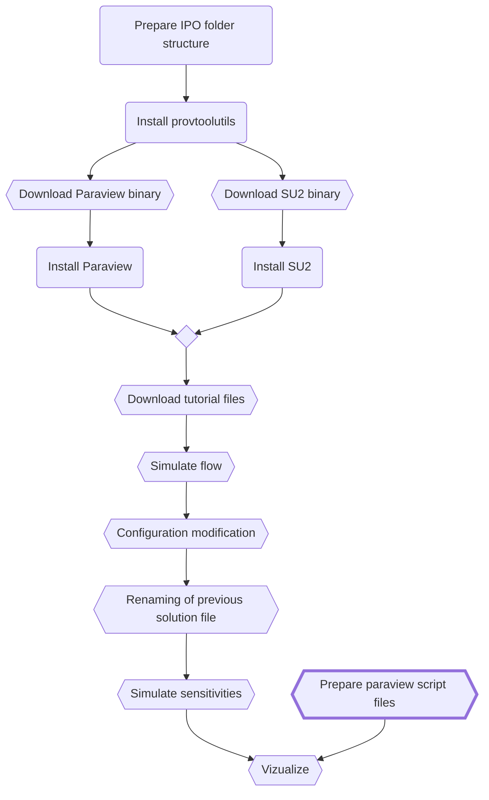
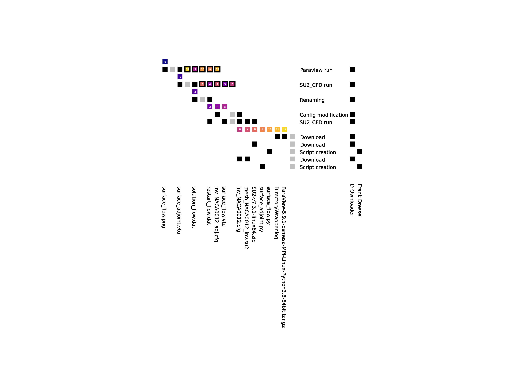

# Examples

[[_TOC_]]

## CFD example

This example demonstrates a small workflow, where a user uses SU2, Paraview and some scripts to simulate the flow around an airfoil. It is meant as a technical example and not as a detailed tutorial how to do flow simulation right. It is based on the SU2 tutorial. For more information about how to use SU2 and Paraview see: [SU2](https://su2code.github.io/) and [Paraview](https://www.paraview.org/). For each step of the workflow, provenance is generated. The provenance is created with the help of the provtool, which assumes input/output directories for each step (see [IPO model](https://en.wikipedia.org/wiki/IPO_model)). Provtool needs two configuration files with information about the executing agent (you) and the tool which is run. If you don't want to use files for that, you can use process substitution (bash, ...) or read from /dev/stdin. The file and /dev/stdin-based approach is used in this example.

The steps of the workflow are implemented into a Dockerfile. While building the container, all steps are performed. There are some housekeeping tasks (like installing system libraries) which are not labeled. The steps according to the diagram below are clearly labeled with the step name:

```docker
################################################################################
# Step name
################################################################################
```

Other comments are just informative. For example for the two steps Download SU2 and Install SU2:

```docker
################################################################################
# Download SU2, Install SU2
################################################################################

WORKDIR /tmp/su2_download
# ENV could be ARG. Not used here because of cache problems in older podman versions
ENV SU2_DOWNLOAD_URL="https://github.com/su2code/SU2/releases/download/v7.3.1/SU2-v7.3.1-linux64.zip"
RUN wget $SU2_DOWNLOAD_URL && unzip SU2-v7.3.1-linux64.zip -d /apps/SU2-v7.3.1
```

The following steps are performed within this small example. The hexagonal nodes are artefacts with a corresponding provennace container. The bold edged step is a manual process while the remaining steps are done automatically.



To build the container run:

```bash
cd provtool
docker build --rm -f src/provtoolutils/examples/cfd/Dockerfile -t provtoolutils-examples .
```

To login into the container and check/modify/rerun the steps and play around:
```bash
docker run --rm -it provtoolutils-examples /bin/bash
```

### Prepare IPO folder structure

Provtool assumes a general process, which consumes data, perform some action and produces output. This maps to a standard input-process-output model. Therefore, a directory structure is generated, which reflects for each tool run (and some intermediate steps) input and output directories.

### Download SU2

The SU2 binary for the underlying Ubuntu is downloaded in a fixed version as zip file. The zip file contains all necessary parts and SU2 is usable after unzipping.

### Install SU2

Unzipping the SU2 archive and place it in the apps directory.

### Download Paraview

The Paraview binary for the underlying Ubuntu is downloaded in a fixed version as tar.gz file. The file contains all necessary parts and Paraview is usable after extraction.

### Install Paraview

Extracting the Paraview archive and place it in the apps directory.

### Generate provenance for tool

Tool installations on systems are in general unreliable with respect to traceability. Too many influences exist (hardware, used system libraries, ...). The best one can do with reasonable effort is tracking version number, download location, time point of installation, ... This is done for SU2 and Paraview with respect to the downloaded binaries in this step. The generated provenance information is used in later steps, when the tool is used to provide a reference to the tool binary itself.

### Download tutorial files

SU2 provides a tutorial with a predefined config and mesh file. These files are downloaded and provenance is attached. The files are directly downloaded into the input directory of the flow simulation step.

### Simulate flow around geometry

SU2 is started with the default configuration from the previous step. It performs a simulation of the external, inviscid flow around around the geometry defined in the basic mesh (NACA0012 air foil).

Provtool works strictly based on a IPO model. Under this assumption, the SU2 binary is treated as input to the process together with the config and mesh file. The detection of input-output relation in provtool is based on the existing provenance container in input and the files in output directory. The provenance container approach uses the provenance part of the container as entry point to each data alone and therefore only the provenance part of the SU2-binary provenance container needs to be in the input directory of the process. It is copied before SU2 is run.

SU2 does not have the concept of a output directory (see [github issue](https://github.com/su2code/SU2/issues/1658)). Therefore, the mot easy approach is to create an empty file directly before calling SU2 and use the time stamp of this file afterwards for a filtered copy of all new files to the output directory (Linux can be so much fun :smile:).

### Simulate sensitivities

This step depends not only on the SU2 binary, but also on the output from the step before as well as on a modified configuration file. At first, the input provenance container from the previous step are copied to the input directory. Both parts are copied: provenance and data. Because the file name of the provenance is dynamic (hash over attributes, which depend for example on the execution time of the previous steps), is is searched by the provtoolutils.search program. After the copy, the files are modified (config file) and renamed (flow solution). Both modification and renaming are treated a small sub process with their own input and output directory. The data is finally merged to the input directory of this step. Again, as in the flow simulation step before, the provenance of the SU2 binary is used as input and the provenance file is copied accordingly.

SU2 is run with the new input files and again the time stamp filtered copying is used to stage the generated data to the output directory before the provenance is generated.

### Prepare Paraview script files

A manual step in which Paraview python scripts are created with the help of the Paraview trace tool. There is a script for visualizing the flow and the sensitivities. The provenance of these files was created again with provtool.

### Visualize pressure coefficient

As in the SU2 step, the provenance of the binary for Paraview is used as input for the visualization step. Additionally, the output from the two SU2 runs is copied (again, provenance files are searched; see description of the previous step). Paraview is called with the two Paraview python scripts, which generates the output images. The file names and paths are hard coded in the scripts. After the images are generated, the provenance information is created.

## Parsing flat file directories

Provenance container are technology independent. Therefore, it is not tied to certain programming languages or libraries. This example shows a simple java service, which scans a given directory and (not implemented yet watches) its content. The provenance part of each container found is evaluated and the data can be queried with a graphql interface as json response.

The source code for this example is provided as a java project in a [subfolder](indexing/flatfileindexing/README.md).

The service defined here takes as input a given directory, which is recursively scanned. Each prov file is treated as a provenance container and its content is analyzed. A simple data schema (see below) allows the definition of graphql queries on the provenance data. An endpoint provides the data in json-format to the user.

```
type Query {
  data: [Provenance]
}
type Provenance {
  entity(label: String): Entity
}
type Entity {
  datahash: String
  label: String
  type: String
};
```

The example is meant as showcasing a direction for further development both with respect to data storage systems (for example data lakes) as well as for interfaces with the help of graphql as unified provenance query language. It is not meant as production tool.

Please see the respective README for more information.

## Visualize as quilt matrix

A provenance graph can be analyzed in various ways. One way suitable for small graphs is based on quilt matrices (see: ). Such a matrix can be generated easily with:

```
python3 -m provtoolvis.file2quilt <Base directory> <entity id> <file name of image>
```

The base directory is searched recursively for provenance container, which are within the graph, which started at the entity, for which the entity is given. This may look like:

```
python3 -m provtoolvis.file2quilt ../.. 0e1b012ede4f985f460e38d76d9ccee5ba3837497054600980e0b1d84949d97a quilt.png
```

The file2quilt program is included in the build image and can be used for example to build the quilt matrix for the generated Paraview images.


