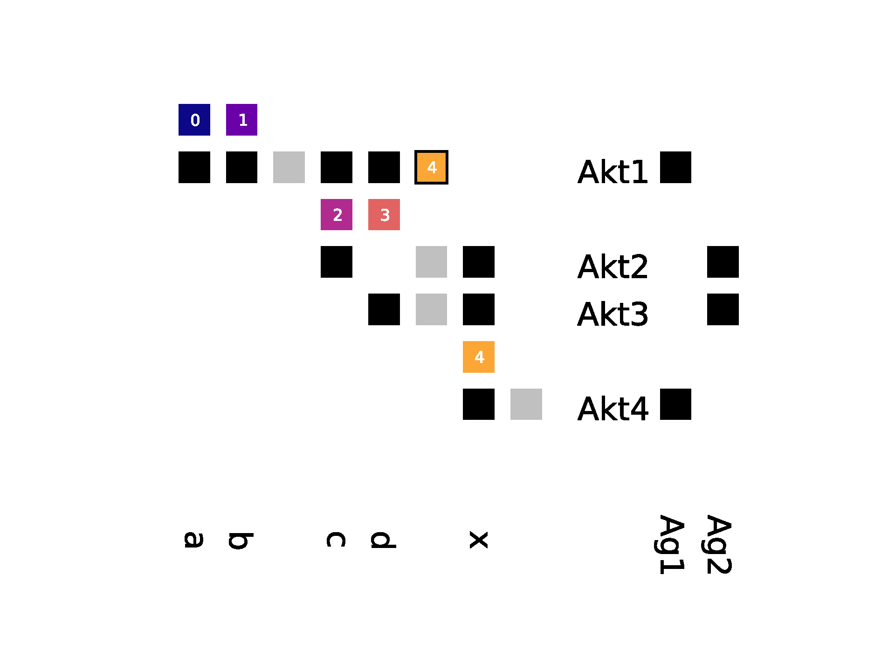

# Visualisation

## Quilt matrix

For the general concept of quilt matrices see: [Juhee Bae and Ben Watson: "Developing and Evaluating Quilts for the Depiction of
Large Layered Graphs" (2011), IEEE TRANSACTIONS ON VISUALIZATION AND COMPUTER GRAPHICS 17(12)](https://www.ncbi.nlm.nih.gov/pubmed/22034346).



## Requirements

You need Python3.7+.

## Installation & upgrade

Create a virtualenv for your project. Make sure, git is installed on your machine and you have a valid account for the repository.

Go to the repository [tags](https://github.com/dlr-sp/provtool/-/tags) and lookup the latest provtoolvistag.

Activate your virtual environment and install [provtoolutils](../utils/README.md) and one of the _provenance container_ reader (for example [../localcontainer/README](../localcontainer/README)).

Install via (replace {username} with your repository user and {tag} with the tag name you want to install):

```
pip install --upgrade "git+https://{username}@github.com/dlr-sp/provtool.git@{tag}#egg=provtoolvis&subdirectory=src/vis"
```

**Example**:

```
pip install --upgrade "git+https://max_mu@github.com/dlr-sp/provtool.git@provtoolvis_0.11.1#egg=provtoolvis&subdirectory=src/vis"
```

To verify a correct installation, type

```
pip show provtoolvis
```

## Building from source

Checkout the project and run:

```bash
cd provtool/src/provtoolvis
pip install -e .
```

## Test

Checkout the project and run:

```bash
cd provtool/src/provtoolvis
tox
```

Many of the tests use a test directory containing reference data. The approach for using the reference data is similar to https://stackoverflow.com/a/29631801.

## Running

For quilt matrix generation you need all the files, which made up the provenance of a given entity. These files can be in a directory structure. The generation process will take into account all prov container in a base directory and all sub directories. 

```bash
python -m provtoolvis.file2quilt --target_id <entityid> --image_file <filename for quilt image (png)> --reader <reader arguments>
```

**Example**

```bash
python -m provtoolvis.file2quilt --target_id 8ef45...75ea --image_file result_file.png --reader directory=.
```
